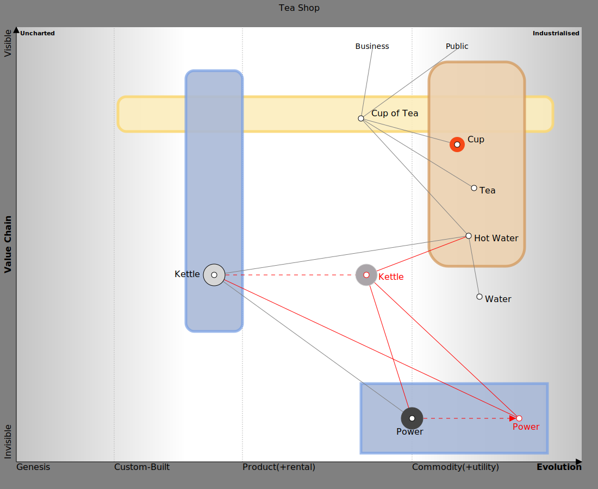

# WardleyToGo

[](https://pkg.go.dev/github.com/owulveryck/wardleyToGo)
[](https://github.com/owulveryck/wardleyToGo/actions/workflows/go.yml)
[](https://codecov.io/gh/owulveryck/wardleyToGo)

A set of primitives to "code a map". In the context of the package "a map" represents a landscape.
The landscape is made of "Components". Each component knows its own location on a map.
Components can collaborate, meaning that they may be linked together. Therefore a map is also a graph.
The entrypoint of this API is the 'Map' structure

## Demo (deprecated)

Check the online demo at [https://owulveryck.github.io/wardleyToGo/](https://owulveryck.github.io/wardleyToGo/)

## Example

First, create a component type
[embedmd]:# (example_draw_test.go /type dummyComponent.*/ /d.id }/)
```go
type dummyComponent struct {
	id       int64
	position image.Point
}

func (d *dummyComponent) GetPosition() image.Point { return d.position }

func (d *dummyComponent) String() string { return strconv.FormatInt(d.id, 10) }

func (d *dummyComponent) ID() int64 { return d.id }
```

Then a collaboration structure (an edge)

[embedmd]:# (example_draw_test.go /type dummyCollaboration.*/ /^}$/)
```go
type dummyCollaboration struct{ simple.Edge }

func (d *dummyCollaboration) GetType() wardleyToGo.EdgeType { return 0 }

func (d *dummyCollaboration) Draw(dst draw.Image, r image.Rectangle, src image.Image, sp image.Point) {
	coordsF := utils.CalcCoords(d.F.(wardleyToGo.Component).GetPosition(), r)
	coordsT := utils.CalcCoords(d.T.(wardleyToGo.Component).GetPosition(), r)
	bresenham.Bresenham(dst, coordsF.X, coordsF.Y, coordsT.X, coordsT.Y, color.Gray{Y: 128})
}
```

And finally create the map

[embedmd]:# (example_draw_test.go /.*m \:= wardleyToGo.NewMap.*/ /.*c1, c3.*/)
```go
	m := wardleyToGo.NewMap(0)
	c0 := &dummyComponent{id: 0, position: image.Pt(25, 25)}
	c1 := &dummyComponent{id: 1, position: image.Pt(50, 50)}
	c2 := &dummyComponent{id: 2, position: image.Pt(50, 75)}
	c3 := &dummyComponent{id: 3, position: image.Pt(75, 75)}
	m.AddComponent(c0)
	m.AddComponent(c1)
	m.AddComponent(c2)
	m.AddComponent(c3)
	// c0 -> c1
	// c1 -> c2
	// c2 -> c3
	// c1 -> c3
	m.SetCollaboration(newCollaboration(c0, c1))
	m.SetCollaboration(newCollaboration(c1, c2))
	m.SetCollaboration(newCollaboration(c2, c3))
	m.SetCollaboration(newCollaboration(c1, c3))
```

## Parser example

Create a map from the owm example:

[embedmd]:# (examples/parser/sample.owm)
```owm
title Tea Shop
anchor Business [0.95, 0.63]
anchor Public [0.95, 0.78]
component Cup of Tea [0.79, 0.61] label [19, -4]
component Cup [0.73, 0.78] label [19,-4] (dataProduct)
component Tea [0.63, 0.81]
component Hot Water [0.52, 0.80]
component Water [0.38, 0.82]
component Kettle [0.43, 0.35] label [-73, 4] (build)
evolve Kettle 0.62 label [22, 9] (buy)
component Power [0.1, 0.7] label [-29, 30] (outsource)
evolve Power 0.89 label [-12, 21]
Business->Cup of Tea
Public->Cup of Tea
Cup of Tea-collaboration>Cup
Cup of Tea-collaboration>Tea
Cup of Tea-collaboration>Hot Water
Hot Water->Water
Hot Water-facilitating>Kettle 
Kettle-xAsAService>Power
build Kettle


annotation 1 [[0.43,0.49],[0.08,0.79]] Standardising power allows Kettles to evolve faster
annotation 2 [0.48, 0.85] Hot water is obvious and well known
annotations [0.60, 0.02]

note +a generic note appeared [0.16, 0.36]

style wardley
streamAlignedTeam stream aligned A [0.84, 0.18, 0.76, 0.95]
enablingTeam team B [0.9, 0.30, 0.30, 0.40]
platformTeam team C [0.18, 0.61, 0.02, 0.94]
complicatedSubsystemTeam team D [0.92, 0.73, 0.45, 0.90]
```

[embedmd]:# (examples/parser/main.go)
```go
package main

import (
	"fmt"
	"log"
	"os"

	"github.com/owulveryck/wardleyToGo/parser/owm"
)

func main() {
	p := owm.NewParser(os.Stdin)
	m, err := p.Parse() // the map
	if err != nil {
		log.Fatal(err)
	}
	fmt.Println(m)
}
```

```shell
> cat examples/parser/sample.owm | go run examples/parser/main.go
2021/04/12 10:03:12 Warning unhandled element at line 21: build Kettle
2021/04/12 10:03:12 Warning unhandled element at line 28: note a generic note appeared
2021/04/12 10:03:12 Warning unhandled element at line 30: style wardley
map {
        0 'Business' [95,63];
        8 '[evolved]Kettle' [43,35];
        1 'Public' [95,78];
        3 'Cup' [73,78];
        9 'Power' [10,70];
        10 '[evolved]Power' [10,70];
        11 'stream aligned A' [76,18,84,95];
        14 'team D' [45,73,92,90];
        5 'Hot Water' [52,80];
        7 'Kettle' [43,35];
        12 'team B' [30,30,90,40];
        2 'Cup of Tea' [79,61];
        4 'Tea' [63,81];
        6 'Water' [38,82];
        13 'team C' [2,61,18,94];

        5 -> 6 [0];
        5 -> 7 [129];
        5 -> 8 [66];
        7 -> 8 [65];
        7 -> 9 [130];
        7 -> 10 [66];
        2 -> 3 [128];
        2 -> 4 [128];
        2 -> 5 [128];
        0 -> 2 [0];
        8 -> 9 [66];
        8 -> 10 [66];
        1 -> 2 [0];
        9 -> 10 [65];
}

```


## Full sample

This example instanciates a parser, reads a modified version of the online wardleymap and renders it as an SVG:

[embedmd]:# (examples/svgoutput/sample.owm)
```owm
title Tea Shop
anchor Business [0.95, 0.63]
anchor Public [0.95, 0.78]
component Cup of Tea [0.79, 0.61] label [19, -4]
component Cup [0.73, 0.78] label [19,-4] (dataProduct)
component Tea [0.63, 0.81]
component Hot Water [0.52, 0.80]
component Water [0.38, 0.82]
component Kettle [0.43, 0.35] label [-73, 4] (build)
evolve Kettle 0.62 label [22, 9] (buy)
component Power [0.1, 0.7] label [-29, 30] (outsource)
evolve Power 0.89 label [-12, 21]
Business->Cup of Tea
Public->Cup of Tea
Cup of Tea-collaboration>Cup
Cup of Tea-collaboration>Tea
Cup of Tea-collaboration>Hot Water
Hot Water->Water
Hot Water-facilitating>Kettle 
Kettle-xAsAService>Power
build Kettle


annotation 1 [[0.43,0.49],[0.08,0.79]] Standardising power allows Kettles to evolve faster
annotation 2 [0.48, 0.85] Hot water is obvious and well known
annotations [0.60, 0.02]

note +a generic note appeared [0.16, 0.36]

style wardley
streamAlignedTeam stream aligned A [0.84, 0.18, 0.76, 0.95]
enablingTeam team B [0.9, 0.30, 0.30, 0.40]
platformTeam team C [0.18, 0.61, 0.02, 0.94]
complicatedSubsystemTeam team D [0.92, 0.73, 0.45, 0.90]
```

[embedmd]:# (examples/svgoutput/main.go)
```go
package main

import (
	"image"
	"log"
	"os"

	svgmap "github.com/owulveryck/wardleyToGo/encoding/svg"
	"github.com/owulveryck/wardleyToGo/parser/owm"
)

func main() {
	p := owm.NewParser(os.Stdin)
	m, err := p.Parse() // the map
	if err != nil {
		log.Fatal(err)
	}
	svgmap.Encode(m, os.Stdout, 1050, 1050, image.Rect(25, 25, 1025, 1025))
}
```


